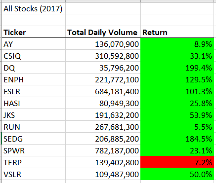
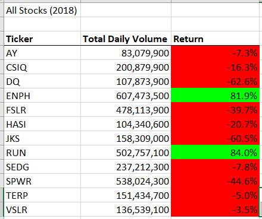
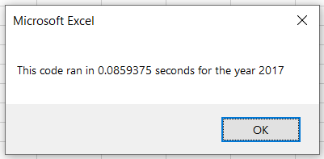
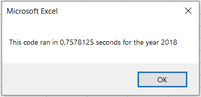
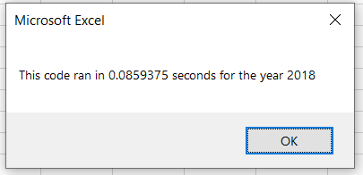

# **VBA Code Refactoring**

## **Overview of Project**

### **Purpose**
Refactor the Module 2 solution code to make the VBA script run faster. This is needed to allow the code to analyze a dataset for thousands of stocks in a timely manner.

## **Results**

- Stock performance in 2017 vs. 2018 (See Figure 1).
    - More stocks in 2017 had a positive return than in 2018.
    - Of the 2018 stocks, the stock with ticker "RUN" was the only stock that outperformed its respective return of the previous year.
    
     

Figure 1

 

- Time performance of original code vs refactored code (See Figure 2).
    - Leveraging [arrays](https://docs.microsoft.com/en-us/office/vba/language/concepts/getting-started/using-arrays) and the fact that the data is already sorted. One of the for loops was able to removed from the code causing the run time to go from n^2 to n. The end result was reduction in run time by nearly 10 times.

 

Figure 2 (Original Time vs. Refactored Time)

 

## **Summary**

- Advantages and disadvantages of refactoring code in general.
    - Refactoring can allow for quick repurposing and maintenance of code. However, if the code is not commented properly or is too large it can be too time consuming to refactor or cause more errors.

- Advantages and disadvantages of original and refactored VBA script in this project.
    - The main advantage of the refactored VBA script is that it gets rid of one of the for loops and thereby reduces the run time. Additionally, the statements that write to the spreadsheet are cleaner as the values are maintained in arrays and iterated on seperately. The disadvantage of the refactored code is that the code is longer in length.
    -  I don't think there is any advantage to the original code, but I do think that both scripts are at a disadvantage as they rely on the data set to be sorted in order for them to work. 
