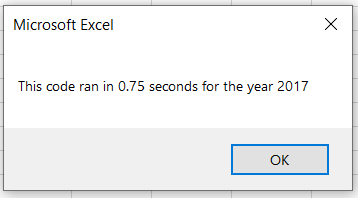

# **VBA Code Refactoring**

## **Overview of Project**

### **Purpose**
Refactor the Module 2 solution code to make the VBA script run faster. This is needed to allow the code to analyze a dataset for thousands of stocks in a timely manner.

## **Results**

- Stock performance in 2017 vs. 2018 (See Figure 1).
    - More stocks in 2017 had a positive return than in 2018.
    - Of the 2018 stocks, the stock with ticker "RUN" was the only stock that outperformed its respective return of the previous year.
    
     

Figure 1

 

- Time performance of original code vs refactored code (See Figure 2).
    - Leveraging [arrays](https://docs.microsoft.com/en-us/office/vba/language/concepts/getting-started/using-arrays) and the fact that the data is already sorted. One of the for loops was able to removed from the code causing the run time to go from n^2 to n. The end result was reduction in run time by nearly 10 times.

 

Figure 2 (Original Time vs. Refactored Time)

 

## **Summary**

- Advantages and disadvantages of refactoring code in general.
    - placeholder

- Advantages and disadvantages of original and refactored VBA script in this project.
    - placeholder